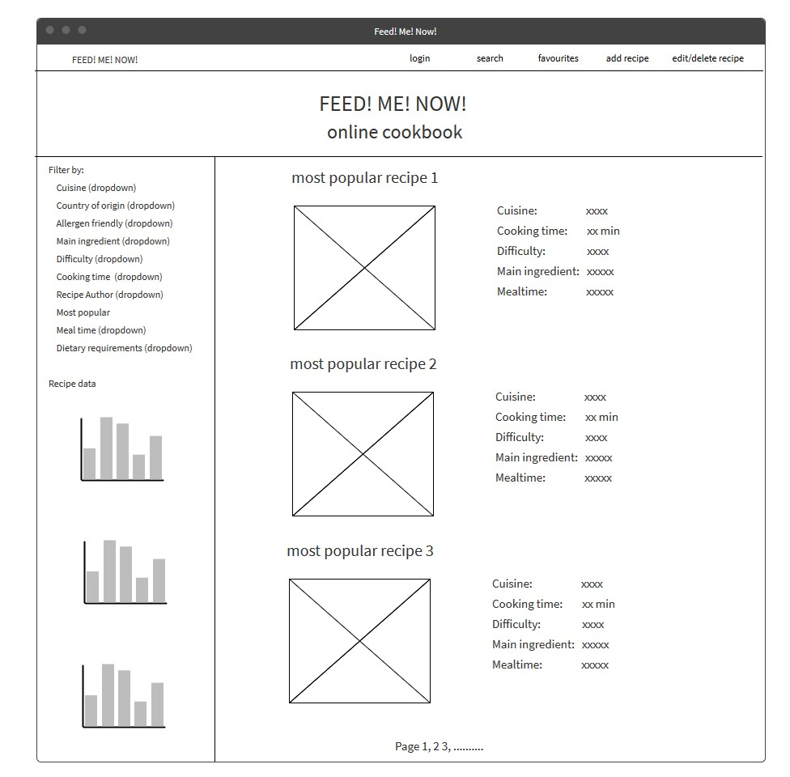
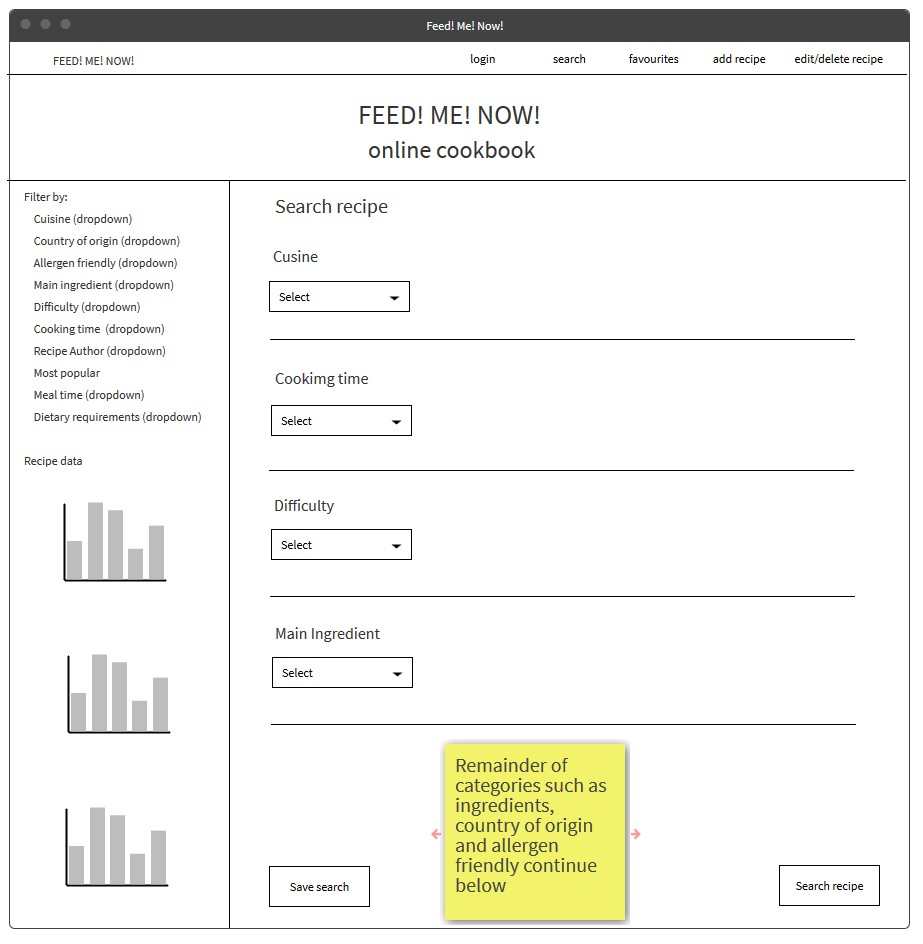
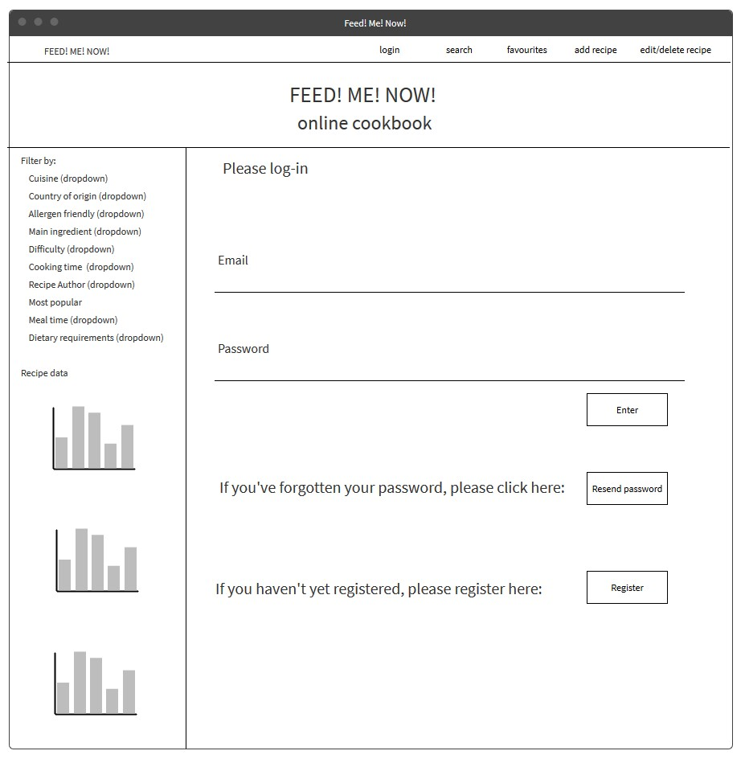

# Milestone Project 4 : Online Cookbook

## Planning of the online cookbook

This online cookbook is aimed at people looking for quick access to recipes from all over the world; of varying difficulty; and with different time pressures.

### User experience

This site allows cooks of various abilities to quickly search for and view recipes. Users with a registered email address and password can add new recipes to the 
site and edit/delete the recipes they have added previously. They also have the ability to like recipes and add/remove recipes from their favourites.

### Vision Statement

*‘The online cookbook website will display user added recipes, preparation instructions and information associated with these recipes. Recipes can be searched on the 
site with the user filtering recipes dependent upon several categories. Logged in users can add new recipes and edit/delete the recipes that they themselves have added. 
They will also have the ability to add any recipe to their favourites list which will be displayed on their favourite’s page. Logged in users will also have the ability 
to up-vote recipes that they have prepared and the most popular recipes will be displayed to all users when accessing the site.’*

### Features list which fulfils the vision

1.	I can search for recipes based on the following search criteria:
    1.	Cuisine
    2.	Country of origin
    3.	Allergens
    4.	Main ingredient
    5.	Difficulty 
    6.	Most popular
    7.	Cooking time
    8.	Meal time
2.	I can save recipes to ‘my favourites’
3.	Added favourites will be added to the user document 
4.	I can remove recipes from ‘my favourites’
5.	Removed favourites will be removed from the user document 
6.	I can add a new recipe
7.	Added recipes will be added as a new recipe document 
8.	Added recipes name added to user document
9.	I can view ‘my added recipes’
10.	‘my added recipes’ stored within the user document 
11.	I can edit recipes that I have added
12.	Edited recipes will update recipe document 
13.	I can delete recipes that I have added
14.	Deleted recipes will delete recipe document in recipe collection and entry from ‘my added recipes’ from user document
15.	I can upvote recipes that I like
16.	The upvote will increment the upvote counter in the recipe document 
17.	I can remove my upvote of a recipe
18.	The removal of the upvote will increment the upvote counter in the recipe document
19.	I can view recipe data and graphical information based on the following:
    1.	Cuisine
    2.	Country of origin
    3.	Allergen 
    4.	Main ingredient
    5.	Difficulty 
    6.	Cooking time
    7.	Meal time
20.	Additional recipe information obtained from data contained within the recipe entry of the recipe document
21.	When I enter the site I’m shown the landing page
22.	Most popular recipes are displayed on the landing page based on the upvotes received 
23.	I can click any recipe shown to be taken to the show recipe page
24.	When I click add recipes I am taken to the add recipe form
25.	When I click edit/delete recipes I am taken to the edit/delete recipe form
26.	When I click search I’m taken to the search form
27.	I can login to the site
28.	The login criteria will be stored in the user document in the user collection
29.	I can register for the site
30.	The password associated with the user's email address will be encrypted and not visible to the database

### User stories

*‘As a parent, I want a chicken recipe which is nut free so that my youngest child can eat the same meal as the rest of the family.’*

>The parent would access the site and click on the search button. The parent would then filter for chicken as the main ingredient, 
the parent can then check if nuts are contained in the allergens of the recipe. The results are then displayed.

*‘As the dinner party host, I want a tasty beef dish that is quick to prepare so that I enjoy time with my guests instead of being stuck in the kitchen all evening.’*

>The host would enter the site and click the search link in the navbar. They would then filter beef as the main ingredient and select a cooking and preparation time less 
than the maximum time they wish to invest in preparing the meal.

*‘As an enthusiastic cook, I want to share my recipes with others so that I can see if others enjoy them too.’*

>The cook would enter the site and click on the add recipe link in the navbar, if they haven’t logged-in they will be asked to log-in. If they haven’t previously registered 
they will be asked to create an account. They will then redirected to the add recipe site where they can add details of their recipe, the recipe is submitted by clicking the 
add recipe button, they will then be redirected to the home page.

*‘As I have uploaded recipes to the site before, I want to change the amount of garlic in my pasta dish, so that the recipe isn’t as overpowering.’*

>The user would enter the site and click on the edit/delete recipe link in the navbar, if they haven’t logged-in they will be asked to log-in then redirected to the edit/delete 
recipe site where they can edit details of their recipe, the recipe is submitted by clicking the edit recipe button, the user will then be redirected to the home page.

*‘As I have uploaded recipes to the site before, I want to delete my recipe as I think there are better versions of this on the site already.’*

>The user would enter the site and click on the edit/delete recipe link in the navbar, if they haven’t logged-in they will be asked to log-in then redirected to the edit/delete 
recipe site where they can delete their recipe, submitted by clicking the delete recipe button. The recipe will then be completely removed from the database, the user will then 
be redirected to the home page.

*‘As a son, I want to go round to make my Italian Mother breakfast in bed on Mother’s day, I want to make a tasty Italian breakfast for her’*

>The son would access the site and click on the search button. The son would then filter for Italian as the cuisine and also filter for breakfast in the mealtime category. The results are 
then displayed.

*‘As a husband, I want to cook that vegan recipe from the site that my wife loved, so that she knows how much I appreciate her’*

>The husband would access the site and click on the favourite’s link in the navbar, if they haven’t logged-in they will be asked to log-in then redirected to the their favourite’s page where 
they can either look through their favourite recipes or filter the results to find it directly.

*‘As a cook, I have just cooked the lamb recipe from the site and want to show that I think it’s a good recipe’*

>The cook accesses the site and searches for the recipe. The cook then clicks the upvote button on the recipe, if they haven’t logged-in they will be asked to log-in then redirected back to 
the page with the upvote now in place.

### Page content and wireframes

#### Base page layout

*Header:* contains site name, links to: log-in if not already completed, personal favourites, home, edit/delete recipe, add recipe, and search.

*Footer:* copyright

*Side bar:* shows list of recipes based on ingredients, allergens, cuisine type, dietary choice, meal time: can add multiple filters selected by user. Shows data on number of recipes based on 
ingredient, cuisine type, meal time. Shows data on most popular of recipes based on ingredient, cuisine type, meal time. 

##### Landing page

Home page on site. Contains header, footer and sidebar. Contains site title. Contains most popular recipes (information and picture) based on up-votes from users. 

##### Show recipe page

Shows image, ingredients, preparation and cooking time, detailed instructions for cooking. 

##### Add recipe page

Form to add name, time, instructions, and ingredients. Contains submit recipe button. 

##### Edit recipe page

Form to edit name, time, instructions, and ingredients, etc.  Contains edit recipe button and delete recipe button (page only visible if it is the author who created the recipe).

##### Search recipe page

Form containing specifics such as allergens, main ingredient, cuisine type, meal time.

##### Search results page

Shows all recipes which match the specified criteria during the search.

##### Favourite recipes page

Contains user’s favourite recipes (information and picture) based on saved recipes.

##### Log-in page

Contains form for username and password and submit button.

##### Add user page

Add new user to site.  Contains header and footer. Contains form to add new user to database.

### Languages/Technologies to be used
-   Flask
-	MongoDB Atlas
-	Python 3
-	JQuery
-	CSS 3
-	HTML 5
-	JS
-	Bootstrap
-	SASS
-	Jinja
-	Heroku
-	dc/d3.js
-	python bcrypt library

### Scripts and files
-	app.py: *contains all code to generate html templates; contains code to open/close connection to database and perform CRUD operations based on the template contents*
-	base.html: *contains the base html content to be used by the site pages*
	index.html: *extends base.html and is the landing page for the site, shows most popular recipes*
-	addrecipe.html: *extends base.html and allows user to add new recipe*
-	editrecipe.html: *extends base.html and allows user to edit or delete recipe*
-	favourites.html: *extends base.html and displays user favourites*
-	search.html: *extends base.html and used to search for recipes*
-	showrecipe.html: *extends base.html and shows details of recipe*
-	login.html: *extends base.html and allows user to log-in to site*
-	register.html: *extends base.html and allows user to register for site*
-	style.css: *contains styles to be used on site*
-	main.js: *contains js code to be executed by site*
-	display.js: *contains data presentation JS code*
-	Test files: *run unit level test on python*
-	Procfile: *tells Heroku how to run the app*
-	requirements.txt: *list of packages to be installed to run application*

### Database schema

The document scheme used to organise the site data on Mongo DB Atlas is a hybrid approach which uses components of both normalised and de-normalised data patterns. All the documents 
required for the site are contained within a single collection and allocated a ‘document’ attribute, as follows:
-	User: *stores specific user data*
-	Recipe: *stores specific recipe data*

The database schema is shown below:

Recipe name and recipe author values are duplicated across the Recipe and User document types as these values will be regularly used whilst the remainder of the Recipe and User properties 
remain separated out.  
