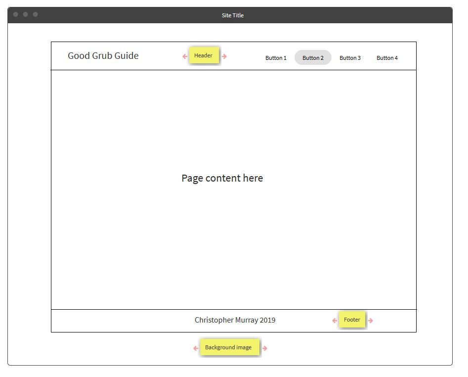

# Milestone Project 4 : Online Cookbook

This project is a web-based cokkbook which allows users to quickly view recipes and find recipes based on both a simple text search and a more advanced category search. 
The user can also register and log-in to the site to access to additional site features such as 'add a new recipe', 'edit a recipe you have added', 'delete a recipe you have added',
'like a recipe' and 'add a recipe to your favourites list'.

All the recipe and user information for the site is stored on a NoSQL database and allows quick access to recipes on the site in addition to quick recipe addition and modification.

## Planning of the online cookbook

The planning undertaken prior to beginning the project is described in the following document: [Project planning document](project_planning.md) 

## Wireframe/site configuration development

As development of the application progressed the layout of the pages also progressed. Around mid-way through the project the site had the following configuration:

Having developed the site on the initial wireframe plan it was felt that the content was far too cramped with having the sidebar for additional content next to the main page content. The configuration 
was redeveloped into a central content area above a background image. This central content area would contain the header elements, the main content and either additional hidden content or links to additional 
content. The site layout was reconfigured as follows:

I also hated the initially planned name and renamed this the 'The Good grub guide' which I don't love either but I can't think of anything better! In practice the website now has the following basic layout:

This layout provides plenty of room to clearly show page content with the header and footer neatly surrounding it.

## Final database schema

As the project developed the database schema did also, to a lesser extent. As stated in the project planning document, the database for the application consisted of two different document types: recipe 
documents and user documents.

The recipe document schema, shown below, contains all information related to the recipe, including a link to the recipe image. The 'recipeEmail' is included to allow verification that the user is the author of the recipe
and is imported from the user session on recipe creation and cannot be altered by any user.

    class recipes(Document):
     class __mongometa__:
         session = session
         name = 'recipe'
     _id = Field(schema.ObjectId)
     recipeName = Field(schema.String)
     recipeAuthor = Field(schema.String)
     recipeCuisine = Field(schema.String)
     recipeCountryOfOrigin = Field(schema.String)
     recipeMealTime = Field(schema.String)
     recipeServings = Field(schema.String)
     recipeDifficulty = Field(schema.String)
     recipePreparationTime = Field(int)
     recipeCookingTime = Field(int)
     recipeAllergen = Field(schema.Array(str))
     recipeMainIngredient = Field(schema.String)
     recipeIngredients = Field(schema.String)
     recipeInstructions = Field(schema.String)
     recipeDietary= Field(schema.Array(str))
     recipeUpvotes = Field(int)
     recipeImageLink = Field(schema.String)
     recipeEmail = Field(schema.String)

The user document schema contains all information related to the site user. The user password is hashed and cannot be seen by anyone. The favouriteRecipes, myRecipes and likedRecipes arrays store the object
ID of the recipes to allow users to quickly access these.

    class users(UserMixin, Document):
     class __mongometa__:
         session = session
         name = 'user'
     _id = Field(schema.ObjectId)
     username = Field(str)
     email = Field(str)
     password = Field(str)
     favouriteRecipes = Field(schema.Array(str))
     myRecipes = Field(schema.Array(str))
     likedRecipes = Field(schema.Array(str))

## Site configuration

### App.py

This is the main application file which initially creates the flask application. It then initialises SSLIFY which forces the flask application to redirect requests to 'https://'. It then 
connects the application to the mongoDB database and imports the environment variables for the application. It then configures the connection to the AWS S3 bucket which is used to store the recipe
images for the website and then configures the Ming ODM session to ensure schema enforcement. This schema is shown in the following: [Document schema](models.py)

Login manager is then initialised by the application to ensure that certain routes require user authentication to view them. The user is authenticated via the log-in page and protected routes 
have the '@login_required' wrapper around the route function. The routes used by the flask application and their purpose are summarised as follows:

#### get recipes function

This function is used in the landing page of the website and queries the database for all recipes sorted in terms of the number of user likes the recipes has. Only the top
5 liked recipes are returned. In addition to this the function also queries the database for all recipes and converts the returned object into BSON which is passed to the 
index page and used for the data for the dc.js data plots. The index page is then rendered.

#### search function
This function gets the user entered search text from the search form on index.html and passes this content to the search_results function. If the content is empty it redirects
the user to the home page and informs them that no search content was entered.

#### search_results function

This function takes the search content and converts it to the correct format to use to query the database. The database is then queried based upon the text score of the
text entered by the user. The number of recipes returned by the query are then counted and the search_results page is rendered.

#### advanced_search function

This function takes in all the fields from the advanced search form and converts it into a format in which the database can be queried. This is then passed to the advanced 
search results function.

#### advanced search results function

This function queries the database for all recipes which match the advanced search parameters and returns those recipes based on the number of likes with a limit of 10 recipes.
The number of recipes returned is then counted and the search_results.html is rendered.

#### browse all recipes function

This function finds all recipes sorted based on the number of likes. The number of recipes returned is the counted and the search_results.html rendered.

#### add recipe function

This function requires user login for access and renders the add recipe form.

#### insert recipe function

This function collates the input fields from the add recipe form and inserts the new recipe into the database. The function then finds this newly created recipe by ID
and renders the show_recipe.html for the newly inserted recipe. In addition to this, the function adds the recipe ID to the user's my-recipes array and informs the user that it can now
be viewed in the my-recipes link.

#### edit delete recipe function

This function requires user login for access and opens the edit_delete_recipe.html form with previously inserted information if the user's email matches the recipe-email field. If it does not match the user
is informed that they are not authorised to edit this document and returned to the home page.

#### update recipe function

This function takes the fields from the edit_delete_recipe.html form and updates the database with the new recipe parameters. It then finds the recipe ID and renders
the show_recipe.html for this specific recipe.

#### show recipe function

This function finds the chosen recipe based on recipe ID and checks whether the user is authenticated: this shows different action buttons based upon the users relationship with the recipe. If the user is the recipe author
the 'edit delete recipe' button is shown otherwise the 'like' and 'favourite' buttons are shown. If the user is not authenticated, no further action buttons are shown.

#### delete recipe function

This function deletes the recipe from the database and removes the recipe from the user's my-recipes and favourites array. The index page is then displayed on deletion and
the user notified.

#### like recipe function

This function requires user log-in. This function checks if the recipe is currently liked by the user and in the user favourites. If not already liked then it will increment
the user like count and return the current recipe page.

#### unlike recipe function

This function requires user log-in. This function checks if the recipe is currently liked by the user and in the user favourites. If already liked then it will decrement
the user like count and return the current recipe page.

#### favourite recipe function

This function requires user log-in. This function checks if the recipe is currently liked by the user and in the user favourites. If not already in the user favourites it will
add the recipe ID to the user favourites array and return the current recipe page.

#### unfavourite recipe function

This function requires user log-in. This function checks if the recipe is currently liked by the user and in the user favourites. If already in user favourites then it will remove the
recipe id from the user favourites array and return the current recipe page.

#### favourites function

This function requires user log-in. This function finds all the recipe ID's in the user favourite array and then search the database for these recipes. The number of recipes 
returned is also counted and the favourites.html page rendered.

#### my-recipes function

This function requires user log-in. This function finds all the recipe ID's in the user my-recipes array and then search the database for these recipes. The number of recipes 
returned is also counted and the my_recipes.html.html page rendered.

#### login function

This function renders the login.html form for user login.

#### submit login function

This function takes the inputs from the login form and searches the database for the user. If the user is found in the database the passwords are checked and if correct
the user is logged in. If the password is incorrect the user is notified and the login page reloaded. If none of the user credentials are correct the user is redirected to the 
register.html form.

#### register function

This page allows users to register new credentials with the website. First of all it checks if the user is already registered and if so redirects the user to the login page.
If not, the user password is hashed and the user added to the database. The function then reders the login page to allow the user to login to the site.

#### log-out function

This function terminates the current user session.

## Site features

For clarity, site features will be outlined in terms of how they are implemented in each of the HTML templates.

### base.html

As the name suggests, the base.html template is used as the basis for the more content specific html templates on the site: each of which will add unique content to 
the standard base.html.

The base.html template consists of a navbar which contains the site logo and the navigation links for the the pages on the site. The site logo, itself, provides a
link anchor which will return the user to the index.html page upon click. This allows the user to easily access the home page from any other page on the website. 

In addition to this, the navigation links are log-in status specific. For example, the add-recipe and favourites links will always be visible but upon click you will only be
redirected to the correct page if you are currently logged-in otherwise you will be redirected to the log-in page after which you will be redirected to the correct page.

Furthermore, if you are not currently logged in: two additional links will be shown. These are log-in and register, clicking on these will redirect the user to the correct 
webpage. If the user is currently logged in, the log-in and register link buttons are replaced with the my-recipes and log-out buttons. The my-recipes button shows the 
recipes added directly by the current user and the log-out button will terminate the user session and return the log-in and register link buttons.

Following the header element, the html document contains the sections where the other page specific content is added e.g. search_results.html would insert the 
recipes found as a result of the search here.

At the bottom of the page is where the footer is located and this contains copyright information for the website.

### index.html

This is the landing page for the site and, firstly, contains a search box to allow the user to enter text to find a list of recipes containing that specific, case insensitive text. 
Following this are three buttons. The first of which is the 'search' button which submits the search text in the search box and returns a list of recipes containing that text; 
the second is the 'advanced search' button which hides the search box and the three buttons and reveals the advanced search form; the third button is the browse all button which 
will return a list of all recipes ordered in terms of the recipes with the highest number of likes to the lowest number of likes. 

#### Advanced search form
As mentioned above, when the 'advanced search' button is clicked: the advanced search form is revealed. This includes the 'text' button which, when clicked, will hide the advanced search form
and 'text' button and return the search box and the three original buttons. The advanced form itself consists of various dropdowns and checkboxes to allow the user to specify
multiple search conditions for the recipe search. This search form is submitted by clicking the 'submit' button at the bottom of the form. 

#### Recipe carousel 

Following the search and advanced search areas of the page there is a recipe carousel which will display the top 5 recipes on the website based upon the number
of likes. Each of these recipes is in the form of a card which contain an image of the recipe itself followed by the recipe name and some information on that recipe such as
recipe author; cuisine; number of servings; preparation and cooking times; difficulty; mealtime; and number of recipe likes. Finally, each recipe has a 'view recipe' button
which will allow the user to navigate to the 'show recipe' page for that specific recipe.

The user can manually scroll through the recipes within the carousel by clicking the next and previous arrow buttons alternatively, the recipe will change on 5 second intervals.

#### Data plots

Following the recipe carousel there is a 'show recipe data' button which shows or hides the dc.js plots of the recipe data. These data plots consist of pie charts for 
recipes by cuisine; recipes by country of origin; and recipes by number of servings. Row charts display recipes by allergen; recipes by dietary requirements; and recipes by
difficulty. Finally, bar charts show recipes by main ingredient; and recipes by combined preparation and cooking times. Whenever a user modifies one of the charts a reset 
button becomes visible to reset that specific chart. Finally, a 'reset all' button will reset all the plots whether they have been modified or not.

### show_recipe.html

When a user chooses to view the recipe they are directed to the show_recipe.html template which extends the base template: adding its unique page content. In this case
the user is directed to the recipe page with information relating directly to the recipe id selected. 

At the top of this page the recipe name is displayed followed by an image of the recipe. Following this is further information relating to this specific recipe. Below this, 
recipe ingredients and recipe step-by step instructions are shown for the recipe.

If the user is not logged-in then the page is complete. However, if the user is logged-in and the user hasn't created this recipe then two buttons appear which let the user
like abd favourite the recipe. When the user likes the recipe: the like count for the recipe is incremented by one and the 'like' button is replaced by the 'unlike' button. Clicking 
the 'unlike' button will decrement the like count and return the 'like' button to the page. Similarly, for the favourites button: when clicked the recipe is added to the
users list of favourite recipes and can be viewed in their 'favourites' page. Upon click, the 'favourite' button is replaced by the 'unfavourite' button. CLicking this button
removes the recipe from the favourites list and returns the 'favourite' button.

If the user is logged-in and is the craetor of the recipe then the 'like' and 'favourite' buttons are replaced with the 'edit/delete' recipe button. This serves two purposes:
firstly, to stop users liking and favouriting their own recipes and secondly, stopping users attempting to modify recipes that they haven't created.

### add_recipe.html

Upon clicking the 'add-recipe' link, the user is redirected to the add-recipe form. This allows the user to add a new recipe to 
the website. The form consists of simple text input fields for recipe name and author fields; dropdown inputs are provided for 
the cuisine; country of origin; mealtime; difficulty; and main ingredient fields. This format is used to limit the inputs that can
be added to the database. Number of servings; preparation time; and cooking time are given as number inputs, again to control the
values that can be added to the database from the user. Dietary and allergens are given as checkbox inputs again limited to what
is acceptable to be passed to the database.

Following these inputs are the add ingredients and add instructions sections. Both these sections have add buttons which reveal
new input textboxes upon click. In addition to this a remove button is also added mext to each textbox to allow the user to delete that
specific textbox. Once the user is satisfied with the inputs they have added the user is asked to confirm these inputs via 
a confirm button. Once, the confirm button is clicked the user is informed that the ingredients or instructions are confirmed.

Finally, the user has the opportunity to add an image of the recipe. The user can upload the image from local storage which will 
ultimately be uploaded to the AWS S3 bucket for the website which contains all the user images.

To submit the recipe the user clicks the 'submit' button at the bottom of the form and they are redirected to the 'show_recipe.html'
for the recipe they have just added and this recipe is added to the users my_recipes array in the database.

### edit-delete-recipe.html

The edit recipe form is identical to the add recipe form in layout with some exceptions. Firstly, the inputs for the 
dropdowns, texboxes and checkboxes have been pre-filled with the information from the saved recipe. All of these are still 
editable. Furthermore, the inputs for the ingredients and instructions sections have also been prefilled with the information f
from the saved recipe. For the add recipe image section, the field to add a new image has not been pre-filled allowing a 
new image to be uploaded however, the current image used by the recipe is shown below the add-image input field. The final difference
between this and the add-recipe form is the 'delete recipe' button located below the submit button form the form.

On submission of the updated recipe the user is again directed to the show_recipe.html for the updated recipe. If the recipe is 
deleted by the user the page redirects to index.html.

### search_results.html

Whenever a search is performed by the user, the results of the search are displayed in the search results page. At the top of the 
page; the user is informed of the number of recipes found in the search and each recipe returned is displayed as a recipe card which 
shows an image of the recipe; recipe name; information for the that recipe; and a 'view recipe' button which will redirect the user to the show_recipe.html for that
specific recipe. In the event that no results are found for the user search: the user is informed that no recipes were found and, in addition to this, there is a 'browse all'
button which will show all the recipes based on number of likes to ensure a consistent flow for the website UX.

### my_recipes.html

When a user adds a recipe it is added to the users my_recipes array in the database. When the user clicks on the 'my-recipes'
link in the navbar they are directed to the 'my_recipes.html' page which will inform the user of the number of recipes they have added and 
will show a card of each of these recipes. This card contains an image of the recipe; recipe name; further information on the recipe; and a view recipe
button which will allow the user to view the 'show_recipe.html' for the recipe and allow access to the edit_delete_recipe button for that recipe.

If the user hasn't yet added any recipes they are informed of this and an 'add_recipe' button is provided which will allow the user to add a new recipe. 
This has been added to improve the UX of the website.

### favourites.html

When a user favourites a recipe it is added to the users favourites array in the database. When the user clicks on the 'favourites'
link in the navbar they are directed to the 'favourites.html' page which will inform the user of the number of recipes they have added to their favourites and 
will show a card of each of these recipes. This card contains an image of the recipe; recipe name; further information on the recipe; and a view recipe
button which will allow the user to view the 'show_recipe.html' for the recipe and allow access to the 'like' and 'favourite' buttons for that recipe.

If the user hasn't yet added any favourite recipes they are informed of this and an 'browse_all_recipes' button is provided which will allow the user to browse all recipes. 
This has been added to improve the UX of the website.

### login.html

When the user clicks the log-in button on the navbar they are directed to the 'login.html' page. This page contains input
fields for the user's email and password. If the user inserts an incorrect password the page is refreshed and the user is informed 
that an incorrect password has been entered. If none of the user credentials are recognised: the user is redirected to the 'register.html' page.
Once the user has logged-in they are redirected back to the home page unless the log-in was triggered by a request for a page that requires authentication wherein 
the user will be redirected to the originally requested page.

### register.html

The register user page allows new users to be added to the website's datasbase. This consists of an html form with fields for username; email; password; and confirm password.
If the password and confirm password do not match the user is informed of this and the register user page is reloaded. Upon submission, the user is added to the database and
redirected to the login page to enter the website.

## Features Left to Implement

Due to time constraints the following features, which would produce a more enjoyable user experience and more professional website, were not implemented:

1. Email on user register to ask users to verify their email address
2. Link for users who have forgotten their log-in credentials to reset them
3. Ability for user to delete account
4. Removal of recipe ID from all user favourites and likes upon recipe deletion
5. Ability for users to save and name their saved searches, this would include an additional webpage showing all saved searches for that user
6. Ability for the user to apply additional filters to the results of a search query

## Technologies Used

The following technologies were used in the development of the application:

1. [Flask](http://flask.pocoo.org):  A microframework for Python
2.	[MongoDB Atlas](https://www.mongodb.com/cloud/atlas): Automated cloud mongoDB service
3. [JQuery](https://jquery.com/): A javascript library used for event handling and DOM manipulation
4. [Bootstrap 4](https://getbootstrap.com/): A toolkit for developing HTML, CSS, and JS
5. [SASS](https://sass-lang.com/): A professional level CSS extension language
6. [Jinja](http://jinja.pocoo.org/docs/2.10/): Templating language for Python
7.	[Heroku](https://dashboard.heroku.com): A cloud platform as a service
8.	[dc.js](https://dc-js.github.io/dc.js/): Dimensional charting javascript library
9. [d3.js](https://d3js.org/): Javascript library for manipulating documents based on data
10. [Ming](https://ming.readthedocs.io/en/latest/): An object document mapper for mongoDB which extends Pymongo
11. [AWS S3](https://aws.amazon.com/s3/): Amazon simple storage device
12. [flask_login](https://flask-login.readthedocs.io/en/latest/): Provides user sessoin management for Flask applications
13. [flask_sslify](https://github.com/kennethreitz/flask-sslify): Converts all incoming requests from application to https
14. [Flask-testing](https://pythonhosted.org/Flask-Testing/): Provides unittesting utilities for Flask
15. [GitHub](https://github.com): used to store and save versions of the application
16. [Cloud9](https://c9.io): online IDE used to develop the application

## Testing

Both automated and manual testing was undertaken on the application and this is described in detail in the following document: [Testing document](testing.md)

## Code validation

The HTML, CSS and JS code was run through code validation to detect any errors.

### HTML validation

The [W3C Markup validation service](https://validator.w3.org/) was used to check the quality of the HTML language used. This was run for all the document templates and the base template as follows:

1. [W3C_base.html](/static/img/verification_docs/W3C_baseHTML.pdf)
2. [W3C_add_recipe.html](/static/img/verification_docs/add_recipe.pdf)
3. [W3C_edit_recipe.html](/static/img/verification_docs/edit_recipe.pdf)
4. [W3C_favourites.html](/static/img/verification_docs/favourites.pdf)
5. [W3C_index.html](/static/img/verification_docs/index.pdf)
6. [W3C_login.html](/static/img/verification_docs/login.pdf)
7. [W3C_my_recipes.html](/static/img/verification_docs/my_recipes.pdf)
8. [W3C_register.html](/static/img/verification_docs/register.pdf)
9. [W3C_search_results.html](/static/img/verification_docs/search_results.pdf)
10. [W3C_show_recipe.html](/static/img/verification_docs/show_recipe.pdf)

The the main issues found due to the use of Jinja. 

### CSS validation

The [W3C CSS validation service](https://jigsaw.w3.org/css-validator/) was used to check the quality of the CSS used. The results are show here:
[W3C_CSS](/static/img/verification_docs/css_validator.pdf)

### JS validation

The written in the main.js and plot.js files was run through [JSHint](https://jshint.com/) with no major errors as follows:

1. [JSHint_main.js](/static/img/verification_docs/main_js_js_hint.pdf)
2. [JSHint_plot.js](/static/img/verification_docs/plot_js_js_hint.pdf)

## Deployment

To deploy the application to Heroku firstly, a new project was created in Heroku. A Procfile was created which is used to tell Heroku how 
to run the application. In addition to this a requirements.txt file was created which told Heroku which Python modules were needed to run the application.  In addition to this, environment variables had to be configured in Heroku.
This was achieved by going to the project settings
in Heroku and implementing the IP and PORT to be used by the application in the config variables settings. In addition to this the name of the mongoDB collection and the URI of the database were
added to these settings. In addition to this,  for security within Flask, a secret key for the application was also added to these variables. The variables used by S3 such as the access key, secret key
and bucket name were configured for use with Heroku by running: 

    $heroku config:set S3_KEY=****** S3_SECRET=******* S3_BUCKET=*********
    
in the console of the Cloud9 application. The project was deployed to Heroku by going to the deploy tab and manually deploying the master branch of the project's Git repository. Once the project was 
successfully deployed, the project was opened by clicking the 'view app' button in Heroku: this was achieved with minimal number of issues.

There is no difference between the deployed and development versions of the application other than in development version debug is set to 'True' whereas in deployment debug is set to 'False'.

## Credits

1. Parallax https://www.w3schools.com/howto/howto_css_parallax.asp
2. https://www.plus2net.com/javascript_tutorial/list-adding.php
3. https://stackoverflow.com/questions/784539/how-do-i-replace-all-line-breaks-in-a-string-with-br-tags   ---new line replace string--
4. https://www.aspsnippets.com/Articles/Get-multiple-selected-checked-CheckBox-values-as-Comma-Separated-String-using-jQuery.aspx--checkboxes to string--
5. https://stackoverflow.com/questions/33677374/jinja2-and-bootstrap-carousel-item-active   ----set carousel item active----
6. https://code.tutsplus.com/tutorials/full-text-search-in-mongodb--cms-24835 -----full text search----
7. https://gist.github.com/cpatrick/5719077 ----text score----
8. https://docs.mongodb.com/manual/reference/method/db.collection.find/ ---sort---
9. https://docs.mongodb.com/manual/reference/operator/update/inc/index.html ---increment---
10. https://stackoverflow.com/questions/13241878/convert-pymongo-cursor-to-json --json object from find results---
11. https://www.geeksforgeeks.org/python-add-new-keys-to-a-dictionary/  --dictionary--
12. https://bl.ocks.org/emiguevara/4bd152a8828f6b31270702d97dc0133d ---plot.js----
13. http://jsfiddle.net/PBrockmann/ma3wr55k  ----histogram-----
14. https://stackoverflow.com/questions/5629805/disabling-enter-key-for-form --- prevent enter key default ---
15. https://stackoverflow.com/questions/27264504/how-to-getchecked-values-and-remove-unchecked-in-array ---checkbox array----
16. https://stackoverflow.com/questions/31012129/selector-not-in-jquery-not-working ---exclude id from search form----
17. https://www.encodedna.com/2013/07/dynamically-add-remove-textbox-control-using-jquery.htm  ---add remove text inputs---
18. https://stackoverflow.com/questions/988228/convert-a-string-representation-of-a-dictionary-to-a-dictionary ----string to dict----
19. http://flask.pocoo.org/docs/1.0/patterns/fileuploads/  ---use flask uploads---
20. https://github.com/MiroslavSvec/DCD_lead --user routes and templates---
21. https://qiita.com/hengsokvisal/items/329924dd9e3f65dd48e7 --UPLOAD AND DOWNLOAD S3 ----
22. https://boh717.github.io/post/flask-login-and-mongodb/  ---flask login with pymongo----
23. https://stackoverflow.com/questions/48934625/objectid-object-has-no-attribute-is-active-flask-login ---m,ore login manager---
24. https://infinidum.com/2018/08/18/making-a-simple-login-system-with-flask-login/ ---m,ore login manager---
25. http://www.patricksoftwareblog.com/tag/flask-login/ ---flask_login---
26. https://www.reddit.com/r/flask/comments/841ka3/questiondoubt_how_to_redirect_to_the_same_page/  ---last page redirect---
27. https://www.tutorialspoint.com/flask/flask_sessions.htm ---FLASK SESSIONS---

